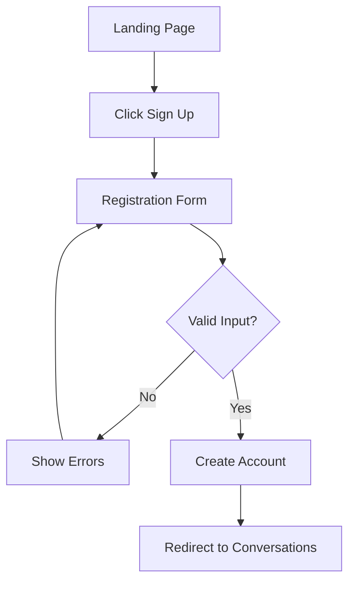
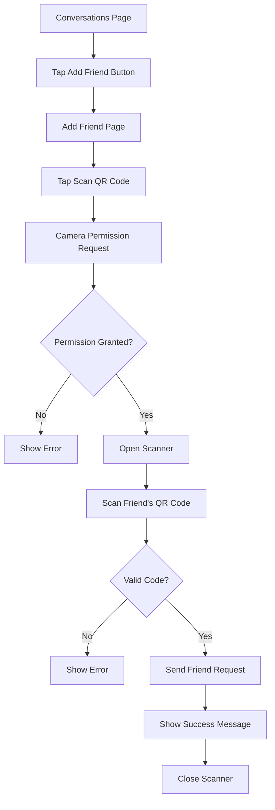
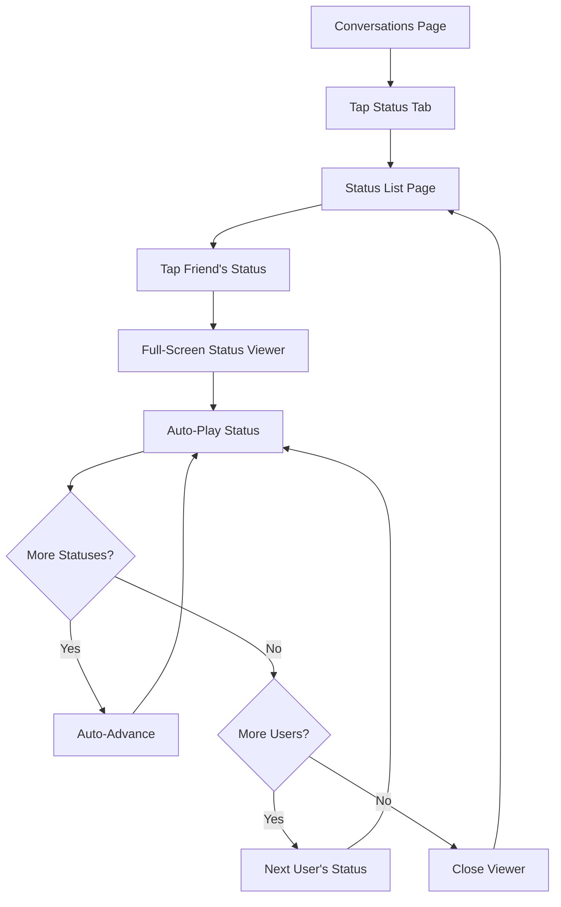
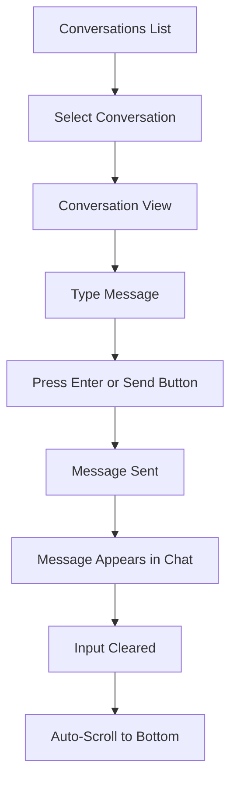

# VibeSync - Product Requirements Document (PRD)

**Version:** 1.0  
**Last Updated:** January 22, 2026  
**Product Owner:** Bhavin  
**Document Status:** Draft

---

## Table of Contents

1. [Executive Summary](#executive-summary)
2. [Product Overview](#product-overview)
3. [Target Audience](#target-audience)
4. [Product Goals & Objectives](#product-goals--objectives)
5. [Feature Requirements](#feature-requirements)
6. [Technical Architecture](#technical-architecture)
7. [User Experience & Design](#user-experience--design)
8. [User Flows](#user-flows)
9. [Non-Functional Requirements](#non-functional-requirements)
10. [Future Roadmap](#future-roadmap)
11. [Success Metrics](#success-metrics)
12. [Appendix](#appendix)

---

## Executive Summary

**VibeSync** is a modern, real-time chat application designed to provide users with a seamless, engaging, and visually stunning messaging experience. Inspired by popular messaging platforms like WhatsApp and Telegram, VibeSync combines essential communication features with a premium, glassmorphic design aesthetic and innovative features like QR code-based friend addition and ephemeral status updates.

The application is built using cutting-edge web technologies (React Router 7, React 19, TypeScript) and emphasizes user experience through smooth animations, responsive design, and both light/dark theme support.

---

## Product Overview

### Vision Statement
To create a next-generation chat application that makes staying connected with friends and family effortless, enjoyable, and visually delightful.

### Product Description
VibeSync is a web-based chat application that enables users to:
- Connect with friends through unique QR codes or friend codes
- Exchange real-time messages in one-on-one conversations
- Share ephemeral photo/video status updates (24-hour stories)
- Make voice and video calls (planned)
- Customize their experience with light/dark themes
- Manage their profile and privacy settings

### Key Differentiators
1. **QR Code Friend Addition** - Instant friend connections via QR code scanning
2. **Premium Design** - Glassmorphic UI with smooth animations and gradients
3. **Modern Tech Stack** - Built with React Router 7 and React 19
4. **Responsive Experience** - Seamless across desktop and mobile devices
5. **Theme Flexibility** - Light, dark, and system-based theme options

---

## Target Audience

### Primary Users
- **Age Group:** 18-45 years old
- **Tech Savviness:** Medium to high
- **Use Case:** Personal communication, staying connected with friends and family
- **Device Preference:** Both mobile and desktop users

### User Personas

#### Persona 1: "The Social Connector"
- **Name:** Sarah, 25
- **Occupation:** Marketing Professional
- **Goals:** Stay connected with friends, share daily moments, quick communication
- **Pain Points:** Complicated friend addition processes, cluttered interfaces
- **VibeSync Value:** Easy QR code friend addition, clean UI, status feature for sharing moments

#### Persona 2: "The Privacy-Conscious User"
- **Name:** Mike, 32
- **Occupation:** Software Engineer
- **Goals:** Secure communication, control over personal data, customizable experience
- **Pain Points:** Lack of privacy controls, forced data sharing
- **VibeSync Value:** Privacy settings, theme customization, no phone number requirement

---

## Product Goals & Objectives

### Primary Goals
1. **User Acquisition:** Achieve 10,000 active users within 6 months of launch
2. **User Engagement:** Average daily active user rate of 60%
3. **User Retention:** 70% 30-day retention rate
4. **Performance:** Sub-second message delivery, 99.9% uptime

### Business Objectives
1. Build a scalable, maintainable chat platform
2. Create a foundation for future monetization (premium features, business accounts)
3. Establish VibeSync as a modern alternative to existing chat applications
4. Gather user feedback for continuous improvement

---

## Feature Requirements

### 1. Authentication & Onboarding

#### 1.1 User Registration
**Priority:** P0 (Critical)  
**Status:** Implemented

**Requirements:**
- Email-based registration with password
- Form validation (email format, password strength)
- Password requirements: Minimum 6 characters
- "Remember me" functionality
- Social authentication options (Google, GitHub) - UI implemented

**User Stories:**
- As a new user, I want to create an account with my email so that I can start using VibeSync
- As a user, I want to sign up with Google/GitHub so that I can quickly create an account

#### 1.2 User Login
**Priority:** P0 (Critical)  
**Status:** Implemented

**Requirements:**
- Email and password authentication
- "Remember me" checkbox for persistent sessions
- "Forgot password" link (UI only)
- Redirect to conversations page upon successful login
- Form validation with error messages

**User Stories:**
- As a returning user, I want to log in with my credentials so that I can access my conversations
- As a user, I want the option to stay logged in so that I don't have to re-enter credentials

---

### 2. Friend Management

#### 2.1 Add Friends via QR Code
**Priority:** P0 (Critical)  
**Status:** Implemented

**Requirements:**
- Camera access for QR code scanning
- Real-time QR code detection using html5-qrcode library
- Visual scanning interface with scanning animation
- Success/error feedback messages
- Automatic friend request sending upon successful scan
- Prevention of self-friending
- Non-mirrored camera stream for natural viewing

**Technical Details:**
- QR code contains: userId, userName, friendCode
- Client-side only component to prevent SSR hydration errors
- Graceful camera permission handling

**User Stories:**
- As a user, I want to scan my friend's QR code so that I can quickly add them
- As a user, I want clear visual feedback during scanning so that I know the app is working
- As a user, I want to be prevented from adding myself so that I don't make mistakes

#### 2.2 Add Friends via Friend Code
**Priority:** P0 (Critical)  
**Status:** Implemented

**Requirements:**
- Manual friend code input with format: XXXX-XXXX-XXXX
- Auto-formatting as user types (adding hyphens)
- Code validation against friend database
- Success/error notifications
- Prevention of self-friending

**User Stories:**
- As a user, I want to manually enter a friend code so that I can add friends without scanning
- As a user, I want the code to be auto-formatted so that it's easier to enter

#### 2.3 My QR Code Display
**Priority:** P1 (High)  
**Status:** Implemented (in Settings)

**Requirements:**
- Generate unique QR code for current user
- Display in modal within Settings page
- QR code contains user identification data
- Shareable/downloadable (future enhancement)

**User Stories:**
- As a user, I want to view my QR code so that others can scan it to add me
- As a user, I want to access my QR code from settings so that I can share it anytime

#### 2.4 Friend Requests
**Priority:** P1 (High)  
**Status:** Partially Implemented (UI ready)

**Requirements:**
- Receive friend request notifications
- Accept/decline friend requests
- Dismiss notifications
- Visual notification component with avatar and user info

**User Stories:**
- As a user, I want to receive friend requests so that I can approve new connections
- As a user, I want to accept or decline requests so that I control who I connect with

---

### 3. Messaging & Conversations

#### 3.1 Conversation List
**Priority:** P0 (Critical)  
**Status:** Implemented

**Requirements:**
- Display all active conversations
- Show last message preview
- Display timestamp (relative: "2m ago", "1h ago", etc.)
- Unread message count badge
- Online/offline status indicator
- Sort by most recent activity
- Search conversations (future)
- Responsive layout (mobile: full screen, desktop: sidebar)

**User Stories:**
- As a user, I want to see all my conversations in one place so that I can quickly access them
- As a user, I want to see unread counts so that I know which conversations need attention
- As a user, I want to see when friends are online so that I know when to expect quick replies

#### 3.2 Message Display
**Priority:** P0 (Critical)  
**Status:** Implemented

**Requirements:**
- Differentiate between sent and received messages
- Display message timestamps
- Show sender name for received messages
- Auto-scroll to latest message
- Message bubbles with distinct styling (sent vs received)
- Responsive message area
- Sticky header with contact info

**User Stories:**
- As a user, I want to see my conversation history so that I can reference past messages
- As a user, I want clear visual distinction between my messages and others' so that I can follow the conversation

#### 3.3 Message Input & Sending
**Priority:** P0 (Critical)  
**Status:** Implemented

**Requirements:**
- Text input field with placeholder
- Send button integrated inside input box
- Send on Enter key press
- Send on button click
- Real-time message addition to conversation
- Input field clears after sending
- Emoji support (future)
- File attachments (future)

**User Stories:**
- As a user, I want to type and send messages so that I can communicate with friends
- As a user, I want to press Enter to send so that messaging is quick and efficient

#### 3.4 Conversation Header
**Priority:** P1 (High)  
**Status:** Implemented

**Requirements:**
- Display contact name
- Show online/offline status
- Avatar display
- Back button (mobile)
- Call buttons (voice/video) - UI only
- Options menu (future)

**User Stories:**
- As a user, I want to see who I'm chatting with so that I don't send messages to the wrong person
- As a user, I want to see if my friend is online so that I know if they're available

---

### 4. Status Feature (Stories)

#### 4.1 View Status Updates
**Priority:** P1 (High)  
**Status:** Implemented

**Requirements:**
- Display status updates from friends
- Separate "Recent" and "Viewed" sections
- Visual indicator for viewed/unviewed statuses
- Status count indicator
- Tap to view full-screen status
- Auto-advance through multiple statuses from same user
- Progress bars for multiple statuses
- Timestamp display
- Auto-advance to next user's statuses after completion

**Technical Details:**
- Status viewer with progress indicators
- Support for image and video content types
- 24-hour expiration (backend implementation pending)
- Smooth transitions between statuses

**User Stories:**
- As a user, I want to view my friends' status updates so that I can see what they're sharing
- As a user, I want statuses to auto-advance so that I don't have to manually navigate
- As a user, I want to see which statuses I've already viewed so that I can focus on new content

#### 4.2 Post Status Updates
**Priority:** P1 (High)  
**Status:** Partially Implemented (UI ready)

**Requirements:**
- Upload photos/videos
- Add text captions (future)
- Preview before posting
- 24-hour auto-deletion
- View own status
- Delete own status (future)

**User Stories:**
- As a user, I want to post photo/video statuses so that I can share moments with friends
- As a user, I want my statuses to disappear after 24 hours so that they remain ephemeral

#### 4.3 Status Viewer
**Priority:** P1 (High)  
**Status:** Implemented

**Requirements:**
- Full-screen immersive viewer
- Progress bars for multiple statuses
- Tap to pause/resume
- Swipe to navigate (future)
- Close button
- Auto-advance to next user
- Display user name and avatar
- Timestamp for each status
- Mark as viewed automatically

**User Stories:**
- As a user, I want an immersive viewing experience so that I can focus on the content
- As a user, I want to control playback so that I can view at my own pace

---

### 5. Calls (Future Feature)

#### 5.1 Voice Calls
**Priority:** P2 (Medium)  
**Status:** Planned

**Requirements:**
- Initiate voice calls from conversation
- Accept/decline incoming calls
- Call history tracking
- Call duration display
- Mute/unmute functionality

#### 5.2 Video Calls
**Priority:** P2 (Medium)  
**Status:** Planned

**Requirements:**
- Initiate video calls from conversation
- Camera toggle
- Screen sharing (future)
- Call quality indicators

#### 5.3 Call History
**Priority:** P2 (Medium)  
**Status:** UI Implemented

**Requirements:**
- Display call history list
- Show call type (voice/video)
- Show call status (missed, incoming, outgoing)
- Display call duration
- Timestamp display
- Quick redial functionality

---

### 6. Settings & Customization

#### 6.1 Profile Settings
**Priority:** P1 (High)  
**Status:** Partially Implemented

**Requirements:**
- Edit profile name
- Upload/change avatar
- Edit status message
- View own friend code
- View own QR code (implemented)

**User Stories:**
- As a user, I want to customize my profile so that friends can recognize me
- As a user, I want to update my status message so that I can share my current mood

#### 6.2 Theme Settings
**Priority:** P1 (High)  
**Status:** Implemented

**Requirements:**
- Light theme option
- Dark theme option
- System theme option (follows OS preference)
- Persistent theme preference (localStorage)
- Smooth theme transitions
- Theme toggle from Settings page

**Technical Details:**
- ThemeContext for global theme management
- CSS custom properties for theme variables
- Glassmorphic design adapts to both themes

**User Stories:**
- As a user, I want to switch between light and dark themes so that I can use the app comfortably in different lighting conditions
- As a user, I want my theme preference saved so that I don't have to change it every time

#### 6.3 Privacy Settings
**Priority:** P1 (High)  
**Status:** Planned

**Requirements:**
- Last seen visibility control
- Profile photo visibility control
- Status visibility control
- Read receipts toggle
- Blocked users management

#### 6.4 Notification Settings
**Priority:** P2 (Medium)  
**Status:** Planned

**Requirements:**
- Enable/disable notifications
- Message notification sounds
- Call notification sounds
- Notification preview settings

#### 6.5 Account Settings
**Priority:** P1 (High)  
**Status:** Planned

**Requirements:**
- Change password
- Email verification
- Two-factor authentication
- Account deletion
- Data export

---

### 7. Navigation & UI Components

#### 7.1 Bottom Navigation (Mobile)
**Priority:** P0 (Critical)  
**Status:** Implemented

**Requirements:**
- Four main tabs: Chats, Status, Calls, Settings
- Active tab highlighting
- Icon-based navigation
- Fixed position at bottom
- Smooth transitions between tabs

**User Stories:**
- As a mobile user, I want easy access to main features so that I can navigate quickly

#### 7.2 Sidebar Navigation (Desktop)
**Priority:** P1 (High)  
**Status:** Implemented

**Requirements:**
- Persistent sidebar with conversation list
- Main content area for selected conversation
- Responsive layout (sidebar + content)
- Smooth transitions

#### 7.3 User Profile Bar
**Priority:** P1 (High)  
**Status:** Implemented

**Requirements:**
- Display current user info
- Avatar display
- Status message
- Quick access to settings
- Online status indicator

---

## Technical Architecture

### Technology Stack

#### Frontend
- **Framework:** React 19.2.3
- **Routing:** React Router 7.12.0
- **Language:** TypeScript 5.9.2
- **Styling:** TailwindCSS 4.1.13
- **Build Tool:** Vite 7.1.7
- **QR Code Libraries:**
  - `html5-qrcode` 2.3.8 (scanning)
  - `react-qr-code` 2.0.18 (generation)

#### Backend (Planned/Future)
- **Server:** Node.js with Express or React Router server
- **Real-time:** WebSocket (Socket.io)
- **Database:** PostgreSQL or MongoDB
- **Authentication:** JWT tokens
- **File Storage:** AWS S3 or similar
- **Caching:** Redis

### Project Structure

```
vibesync/
├── app/
│   ├── components/
│   │   ├── auth-layout.tsx
│   │   ├── chat/
│   │   │   ├── bottom-nav.tsx
│   │   │   ├── call-history-list.tsx
│   │   │   ├── conversation-list.tsx
│   │   │   ├── message-area.tsx
│   │   │   ├── message-input.tsx
│   │   │   ├── settings-list.tsx
│   │   │   ├── sidebar.tsx
│   │   │   └── status-list.tsx
│   │   ├── friends/
│   │   │   ├── friend-code-input.tsx
│   │   │   ├── friend-request-notification.tsx
│   │   │   ├── qr-code-display.tsx
│   │   │   ├── qr-scanner-wrapper.tsx
│   │   │   └── qr-scanner.tsx
│   │   ├── status/
│   │   │   └── status-viewer.tsx
│   │   └── ui/
│   │       ├── avatar.tsx
│   │       ├── button.tsx
│   │       └── input.tsx
│   ├── contexts/
│   │   └── theme-context.tsx
│   ├── routes/
│   │   ├── add-friend.tsx
│   │   ├── chat.tsx
│   │   ├── conversation-detail.tsx
│   │   ├── conversations-index.tsx
│   │   ├── conversations-layout.tsx
│   │   ├── home.tsx
│   │   ├── login.tsx
│   │   ├── register.tsx
│   │   └── status.tsx
│   ├── types/
│   ├── app.css
│   ├── root.tsx
│   └── routes.ts
├── public/
├── package.json
├── tsconfig.json
├── vite.config.ts
└── react-router.config.ts
```

### Data Models (Planned)

#### User
```typescript
interface User {
  id: string; // UUID
  name: string;
  email: string;
  avatar?: string;
  friendCode: string; // Format: XXXX-XXXX-XXXX
  status: string;
  online: boolean;
  lastSeen?: Date;
  createdAt: Date;
  updatedAt: Date;
}
```

#### Conversation
```typescript
interface Conversation {
  id: string; // UUID
  participants: User[];
  lastMessage: Message;
  unreadCount: number;
  createdAt: Date;
  updatedAt: Date;
}
```

#### Message
```typescript
interface Message {
  id: string; // UUID
  conversationId: string; // UUID
  senderId: string; // UUID
  content: string;
  type: 'text' | 'image' | 'video' | 'file';
  timestamp: Date;
  read: boolean;
  delivered: boolean;
}
```

#### Status
```typescript
interface Status {
  id: string; // UUID
  userId: string; // UUID
  type: 'image' | 'video';
  mediaUrl: string;
  caption?: string;
  backgroundColor: string;
  timestamp: Date;
  expiresAt: Date;
  viewedBy: string[]; // User IDs who viewed
}
```

#### FriendRequest
```typescript
interface FriendRequest {
  id: string; // UUID
  senderId: string; // UUID
  receiverId: string; // UUID
  status: 'pending' | 'accepted' | 'declined';
  createdAt: Date;
}
```

### State Management
- **Local State:** React useState for component-level state
- **Context API:** Theme management, user authentication
- **Future:** Consider Redux Toolkit or Zustand for complex state

### API Endpoints (Planned)

#### Authentication
- `POST /api/auth/register` - User registration
- `POST /api/auth/login` - User login
- `POST /api/auth/logout` - User logout
- `POST /api/auth/refresh` - Refresh JWT token

#### Users
- `GET /api/users/me` - Get current user
- `PUT /api/users/me` - Update current user
- `GET /api/users/:id` - Get user by ID
- `GET /api/users/by-code/:friendCode` - Find user by friend code

#### Friends
- `GET /api/friends` - Get friend list
- `POST /api/friends/request` - Send friend request
- `PUT /api/friends/request/:id/accept` - Accept friend request
- `PUT /api/friends/request/:id/decline` - Decline friend request
- `DELETE /api/friends/:id` - Remove friend

#### Conversations
- `GET /api/conversations` - Get all conversations
- `GET /api/conversations/:id` - Get conversation by ID
- `POST /api/conversations` - Create new conversation
- `GET /api/conversations/:id/messages` - Get messages

#### Messages
- `POST /api/messages` - Send message
- `PUT /api/messages/:id/read` - Mark message as read
- `DELETE /api/messages/:id` - Delete message

#### Status
- `GET /api/status` - Get all status updates
- `POST /api/status` - Create status update
- `DELETE /api/status/:id` - Delete status
- `PUT /api/status/:id/view` - Mark status as viewed

#### Calls (Future)
- `POST /api/calls/initiate` - Initiate call
- `GET /api/calls/history` - Get call history

---

## User Experience & Design

### Design Principles

1. **Clarity:** Clear visual hierarchy and intuitive navigation
2. **Consistency:** Uniform design patterns across all features
3. **Feedback:** Immediate visual feedback for all user actions
4. **Accessibility:** WCAG 2.1 AA compliance (future goal)
5. **Performance:** Smooth animations, fast load times

### Design System

#### Color Palette

**Primary Colors:**
- Primary: `hsl(262, 83%, 58%)` - Purple
- Primary Dark: `hsl(262, 83%, 48%)`
- Secondary: `hsl(198, 93%, 60%)` - Blue
- Accent: `hsl(330, 85%, 65%)` - Pink

**Semantic Colors:**
- Success: `hsl(142, 76%, 36%)` - Green
- Warning: `hsl(38, 92%, 50%)` - Orange
- Error: `hsl(0, 84%, 60%)` - Red

**Neutral Colors:**
- Light theme: Gray 50-900
- Dark theme: Gray 900-50 (inverted)

#### Typography
- **Font Family:** Outfit (Google Fonts)
- **Headings:** Bold, larger sizes
- **Body:** Regular weight
- **Captions:** Smaller, gray color

#### Spacing
- Base unit: 4px
- Common spacing: 8px, 12px, 16px, 24px, 32px

#### Border Radius
- Small: 8px
- Medium: 12px
- Large: 16px
- Full: 9999px (circular)

#### Glassmorphism
- Background: `rgba(255, 255, 255, 0.1)` (dark) / `rgba(255, 255, 255, 0.9)` (light)
- Backdrop filter: `blur(16px)`
- Border: `1px solid rgba(255, 255, 255, 0.1)`

### Animations

1. **Fade In:** 0.5s ease-out
2. **Slide In:** 0.5s ease-out (left/right)
3. **Pulse:** For loading states
4. **Shimmer:** For skeleton loaders
5. **Scan Animation:** For QR scanner

### Responsive Breakpoints

- **Mobile:** < 768px
- **Tablet:** 768px - 1024px
- **Desktop:** > 1024px

### Mobile-First Approach
- Design for mobile first
- Progressive enhancement for larger screens
- Touch-friendly targets (minimum 44x44px)

---

## User Flows

### 1. User Registration Flow



**Steps:**
1. User lands on home page
2. Redirected to login page
3. Clicks "Sign up" link
4. Fills registration form (name, email, password)
5. Submits form
6. System validates input
7. Account created
8. User redirected to conversations page

### 2. Add Friend via QR Code Flow



**Steps:**
1. User navigates to Add Friend page
2. Taps "Scan QR Code" button
3. Camera permission requested
4. Scanner opens with live camera feed
5. User points camera at friend's QR code
6. Code detected and validated
7. Friend request sent automatically
8. Success message displayed
9. Scanner closes

### 3. View Status Updates Flow



**Steps:**
1. User taps Status tab in bottom navigation
2. Status list displayed (Recent/Viewed sections)
3. User taps on a friend's status
4. Full-screen viewer opens
5. Status plays automatically
6. Progress bar shows advancement
7. Auto-advances through user's statuses
8. Auto-advances to next user's statuses
9. Closes when all statuses viewed

### 4. Send Message Flow



**Steps:**
1. User selects conversation from list
2. Conversation view opens
3. User types message in input field
4. User presses Enter or clicks Send button
5. Message sent to backend (currently mock)
6. Message appears in chat with timestamp
7. Input field clears
8. Chat auto-scrolls to show new message

---

## Non-Functional Requirements

### Performance
- **Page Load Time:** < 2 seconds on 3G connection
- **Message Delivery:** < 1 second in real-time
- **Status Load Time:** < 3 seconds for images, < 5 seconds for videos
- **Animation Frame Rate:** 60 FPS minimum

### Scalability
- Support 100,000+ concurrent users
- Handle 1 million+ messages per day
- Efficient database queries with indexing
- CDN for static assets and media files

### Security
- **Authentication:** JWT with refresh tokens
- **Password Storage:** Bcrypt hashing
- **HTTPS:** Enforce SSL/TLS
- **Input Validation:** Sanitize all user inputs
- **XSS Protection:** Content Security Policy
- **CSRF Protection:** CSRF tokens for state-changing operations
- **Rate Limiting:** Prevent abuse and DDoS

### Reliability
- **Uptime:** 99.9% availability
- **Data Backup:** Daily automated backups
- **Error Handling:** Graceful degradation
- **Monitoring:** Real-time error tracking (Sentry, etc.)

### Accessibility
- **WCAG 2.1 AA Compliance** (future goal)
- Keyboard navigation support
- Screen reader compatibility
- Sufficient color contrast ratios
- Alt text for images
- ARIA labels for interactive elements

### Browser Support
- **Modern Browsers:**
  - Chrome 90+
  - Firefox 88+
  - Safari 14+
  - Edge 90+
- **Mobile Browsers:**
  - iOS Safari 14+
  - Chrome Mobile 90+

### Internationalization (Future)
- Multi-language support
- RTL language support
- Locale-specific date/time formatting
- Currency formatting

---

## Future Roadmap

### Phase 1: MVP (Current - Q1 2026)
- ✅ User authentication (login/register)
- ✅ Friend management (QR code, friend code)
- ✅ Basic messaging
- ✅ Status feature
- ✅ Theme switching
- ✅ Responsive design

### Phase 2: Core Features (Q2 2026)
- 🔄 Backend integration (WebSocket for real-time)
- 🔄 Database implementation
- 🔄 Real message persistence
- 🔄 User profile editing
- 🔄 Friend request system (backend)
- 🔄 Status upload functionality
- 🔄 Push notifications

### Phase 3: Enhanced Features (Q3 2026)
- 📋 Voice calls
- 📋 Video calls
- 📋 Group chats
- 📋 Message search
- 📋 Media sharing (images, videos, files)
- 📋 Message reactions (emoji)
- 📋 Message forwarding
- 📋 Message deletion

### Phase 4: Advanced Features (Q4 2026)
- 📋 End-to-end encryption
- 📋 Voice messages
- 📋 Location sharing
- 📋 Contact sync
- 📋 Message scheduling
- 📋 Disappearing messages
- 📋 Custom stickers
- 📋 Chat backup/restore

### Phase 5: Premium Features (2027)
- 📋 Business accounts
- 📋 Channels/Broadcasts
- 📋 Bots and automation
- 📋 Advanced analytics
- 📋 Custom themes
- 📋 Increased storage limits
- 📋 Priority support

**Legend:**
- ✅ Completed
- 🔄 In Progress
- 📋 Planned

---

## Success Metrics

### User Acquisition
- **Monthly Active Users (MAU)**
- **Daily Active Users (DAU)**
- **DAU/MAU Ratio** (target: 60%+)
- **New User Registrations** per week/month
- **Referral Rate** (users inviting friends)

### User Engagement
- **Average Session Duration** (target: 10+ minutes)
- **Messages Sent per User** per day (target: 20+)
- **Status Views per User** per day
- **Status Posts per User** per week
- **Friend Connections per User** (target: 10+)

### User Retention
- **Day 1 Retention** (target: 80%+)
- **Day 7 Retention** (target: 60%+)
- **Day 30 Retention** (target: 40%+)
- **Churn Rate** (target: < 5% monthly)

### Technical Metrics
- **Page Load Time** (target: < 2s)
- **Message Delivery Time** (target: < 1s)
- **Error Rate** (target: < 0.1%)
- **Uptime** (target: 99.9%+)
- **API Response Time** (target: < 200ms)

### Feature Adoption
- **QR Code Scans** per user
- **Theme Switch Rate**
- **Status Feature Usage** (% of users posting)
- **Call Feature Usage** (when implemented)

---

## Appendix

### A. Glossary

- **Friend Code:** Unique 12-character code (format: XXXX-XXXX-XXXX) for adding friends
- **Glassmorphism:** Design style using transparency and blur effects
- **Status:** Ephemeral photo/video update visible for 24 hours
- **Conversation:** One-on-one chat between two users
- **SSR:** Server-Side Rendering
- **Hydration:** Process of attaching React to server-rendered HTML

### B. References

#### Design Inspiration
- WhatsApp Web
- Telegram Web
- Discord
- Slack

#### Technical Documentation
- [React Router 7 Docs](https://reactrouter.com/)
- [React 19 Docs](https://react.dev/)
- [TailwindCSS Docs](https://tailwindcss.com/)
- [html5-qrcode Library](https://github.com/mebjas/html5-qrcode)

### C. Conversation History Summary

Based on past development conversations:

1. **QR Scanner Implementation** (Jan 21, 2026)
   - Fixed dual camera stream issue
   - Resolved SSR hydration errors
   - Implemented non-mirrored camera view
   - Fixed sticky header issues

2. **Theme Switcher** (Jan 21, 2026)
   - Implemented light/dark/system theme options
   - Created ThemeContext for global state
   - Integrated theme toggle in Settings
   - Persisted theme preference in localStorage

3. **Status Feature** (Jan 17-21, 2026)
   - Created WhatsApp-like status feature
   - Implemented status viewer with auto-advance
   - Fixed status skipping bugs
   - Resolved React rendering errors
   - Added progress bars for multiple statuses

4. **UI/UX Refinements** (Jan 16, 2026)
   - Fixed hydration mismatch errors
   - Unified message input design
   - Improved responsive layouts
   - Enhanced mobile experience

### D. Known Issues & Technical Debt

1. **Backend Integration:** Currently using mock data, needs real backend
2. **WebSocket:** Real-time messaging not yet implemented
3. **File Upload:** Status upload UI exists but no backend
4. **Authentication:** No actual JWT implementation
5. **Database:** No persistent storage
6. **Error Handling:** Limited error boundary implementation
7. **Testing:** No unit/integration tests yet
8. **Accessibility:** ARIA labels incomplete
9. **Performance:** No lazy loading for images/videos
10. **SEO:** Limited meta tags and social sharing

### E. Development Environment

**Prerequisites:**
- Node.js 18+
- npm or pnpm
- Modern browser with camera support (for QR scanning)

**Setup:**
```bash
npm install
npm run dev
```

**Build:**
```bash
npm run build
npm start
```

**Type Checking:**
```bash
npm run typecheck
```

---

## Document Change Log

| Version | Date | Author | Changes |
|---------|------|--------|---------|
| 1.0 | Jan 22, 2026 | Bhavin | Initial PRD creation based on project analysis and conversation history |

---

**End of Document**
